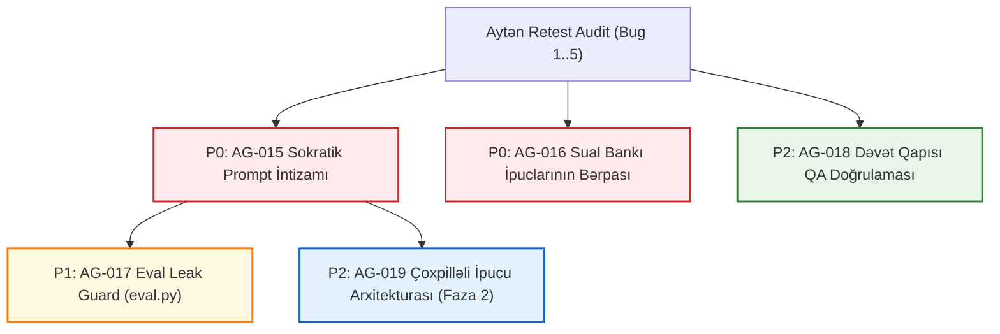

# Texniki Tapşırıqlar Toplusu: Sokratik İpucu İntizamı, Sual Bankı Bərpası və Retest Bərkidilməsi (AG-015 .. AG-019)

**Sənəd Növü:** Business Analysis & Technical Specification (Texniki Tapşırıq / PRD)  
**Müəllif:** IT Business Analyst (`/it-business-analyst`)  
**Mənbə Girişi:** `C:\Users\user\Downloads\AYTEN-RETEST-AFTER-PUSH.md` (Aytən Retest, Vercel Live `?t=20260911-1957-freshtest`)  
**Tarix:** 2026-09-12  
**Status:** `Təsdiqlənib / İcraya Hazır`  
**Əlaqəli Sənədlər:** [`CLAUDE.md`](file:///c:/Programming/Tehsil-Platformasi/CLAUDE.md), [`docs/PHASE-1.md`](file:///c:/Programming/Tehsil-Platformasi/docs/PHASE-1.md), [`docs/STEP-SCHEMA.json`](file:///c:/Programming/Tehsil-Platformasi/docs/STEP-SCHEMA.json), [`docs/DIM-GLOSSARY.md`](file:///c:/Programming/Tehsil-Platformasi/docs/DIM-GLOSSARY.md), [`docs/decisions/ADR-017-answer-isolation.md`](file:///c:/Programming/Tehsil-Platformasi/docs/decisions/ADR-017-answer-isolation.md), [`docs/BACKLOG.md`](file:///c:/Programming/Tehsil-Platformasi/docs/BACKLOG.md).

---

## 1. Kontekst və Biznes Probleminin Təsviri

2026-09-11 tarixində commit `e83a200` sonrası canlı mühitdə 9-cu sinif abituriyent personası (Aytən) tərəfindən həyata keçirilən re-test platformanın texniki erqonomikasında mühüm irəliləyişləri təsdiq etdi:
1. **Kamera fallback-i (Bug 2):** Kamera aşkarlanmadıqda böyük aktiv "Şəkil seç" CTA-sı uğurla işləyir (**PASS**).
2. **Ekvivalent formalar (Bug 3):** `m>25/4` bərabərsizliyi dərslik forması kimi qəbul olunur (**PASS**).
3. **Final status ziddiyyəti (Bug 5):** Yaşıl uğur qutusundakı "həll səhvdir" mətni kənarlaşdırılıb, şikayət linki ("İzahda xəta var? Səhv bildir") footer zonasına keçirilib (**PASS**).

### Əsas Boşluq və Təhlükə (P0)
Bununla belə, sınaq platformanın **ən əsas fərqləndirici dəyər təklifində ("Rəqiblər hazır cavab verir, biz harada ilişdiyini öyrədirik") kritik bir boşluq üzə çıxardı (Bug 4 - FAIL):**
- Şagird addımda ilişib "Bu addımı başa düşmədim" (İpucu) düyməsinə basdıqda sistem ona konseptual dərslik istiqaməti vermək əvəzinə, addımın hazır həllini və ya birbaşa 1 addımlıq primitiv hesabını sızdırır:
  - *Sitat:* `"6,25-dən böyük ilk tam ədədi götür."`
  - *Sitat:* `"25 − 4·7 hesabla."`
  - *Bank sualı 4a2fa001 (Ehtimal):* `check.ask` = *"Köklərin sayı neçədir?"* ➔ `hint` = *"Köklər x=0, 4, 5-dir, yəni cəmi 3 kök var."* (Birbaşa cavab sızması!)
- **Pedaqoji Nəticə:** Şagird düşünmədən hazır rəqəmi köçürür, özünü "öyrənən" yox, "kopyalayan" hiss edir, `error_code` qeydiyyatı bypass olunur, valideynə saxta irəliləyiş hesabatı gedir, şagirdin motivasiyası 3/5-ə düşür.

---

## 2. 7-Vektor Tələb Dekonstruksiya Matrisi

| Vektor | AG-015 (Prompt İntizamı) | AG-016 (Bank Bərpası) | AG-017 (Eval Leak Guard) | AG-018 (Dəvət QA) |
|---|---|---|---|---|
| **1. Actor** | LLM Kaskad (Qat 5 / Vision LLM) | Verilənlər Bazası / Admin miqrasiyası | CI/CD Eval Harness (`eval.py`, Preflight) | QA Tester / Abituriyent |
| **2. Trigger** | `/api/solve` çağırışı (yeni sual həlli) | Miqrasiyanın icrası / Sual bankı sorğusu | `npm test` / `python eval.py` icrası | İstifadəçi təmiz brauzerlə `/kamera` açdıqda |
| **3. Preconditions** | Şagird foto göndərir | Supabase `question_translations` mövcuddur | Golden dataset sualları və addımları mövcuddur | Brauzerdə `INVITE03` tokeni yoxdur |
| **4. Core Behavior** | Prompt yalnız Sokratik qayda tələb edir, rəqəmsiz istiqamət verir | 224 sualın `hint` mətnləri Sokratik formaya salınır | Addımın `hint`-ində cavab tokenləri axtarılır, varsa xəta atılır | Səhv/bitmiş kodda "demo" kartı çıxır, bir kliklə açılır |
| **5. Constraints** | `hint` $\le$ 140 simvol, 0% semantik sızma | Mövcud addım indeksləri və ID-lər pozulmamalıdır | Yoxlama icra vaxtı < 2 saniyə olmalıdır | Heç bir kənar koda yönləndirməməlidir |
| **6. Output & Value** | Şagird dərslik qaydasını xatırlayır, motivasiya artır | Bank suallarında keyfiyyət və pedaqoji dürüstlük | Sızmalar istehsalata çıxmadan CI-da bloklanır | Dəvət divarında ilişib qalma riski 0% olur |
| **7. Failure Modes** | LLM təlimata tabe olmur (sxem validatoru tutur) | SQL JSON formatını pozur (rollback tələb olunur) | Yanlış pozitiv (false positive) söz oxşarlığı | localStorage təmizlənmir (test təlimatı çatışmır) |

---

## 3. Sistem Təsiri və İnvariantlar (System Impact Analysis)

1. **Faza 1 Qapısı ([`docs/PHASE-1.md`](file:///c:/Programming/Tehsil-Platformasi/docs/PHASE-1.md)):**
   - 15–20 real şagirdin gəlişi ərəfəsində şagirdin "özüm həll etdim" zəfər hissini qorumaq P0 tələbdir. İpucunun cavab verməsi retensiya qapısını (7 gündə $\ge 3$ dəfə qayıdış) təhlükə altına atır.
2. **Sıfır Sızma Müqaviləsi ([`docs/decisions/ADR-017-answer-isolation.md`](file:///c:/Programming/Tehsil-Platformasi/docs/decisions/ADR-017-answer-isolation.md)):**
   - ADR-017 texniki səviyyədə `private.question_answers` ilə cavabları gizlətsə də, `hint` mətni semantik sızma mənbəyidir. Bu sənədlə **Semantik Sızma Qadağası (Semantic Zero-Leakage)** qanuniləşdirilir.
3. **Müqavilə və Sxem ([`docs/STEP-SCHEMA.json`](file:///c:/Programming/Tehsil-Platformasi/docs/STEP-SCHEMA.json)):**
   - Sxemdə `steps[].hint` sahəsi qalır (uzunluq $\le 140$ simvol). Sxema breaking change TƏLƏB EDİLMİR.
4. **Vahid İqtisadiyyatı:**
   - Prompt təkmilləşdirməsi token sayını artırmır ($\le \$0.010$/həll çərçivəsində qalır).
   - Bank sualları üçün LLM xərci sıfırdır (\$0.000).

---

## 4. Ətraflı Texniki Tapşırıqlar (Task Specifications)

---

### 🔴 AG-015: Sokratik İpucu İntizamı və Semantik Sızmanın Qadağan Edilməsi
- **Sahə:** Prompt Mühəndisliyi / Kaskad Qat 5 / Pedaqogika
- **Prioritet:** **P0** (Blocker) | **Status:** `To Do`
- **Məsuliyyət:** Backend / LLM Prompt Engineer

#### A. İstifadəçi Hekayəsi (User Story)
```markdown
**Kim kimi:** 9-cu sinif abituriyenti (Aytən)
**İstəyirəm ki:** Addımda çətinlik çəkib "İpucu" düyməsinə basdıqda, sistem mənə hazır cavabı və ya vurma-çıxma əmrini deyil, dərslikdəki müvafiq qayda və ya teoremi xatırlatsın
**Ona görə ki:** Həlli öz beynimlə tapım, "özüm etdim" zəfərini yaşayım və DİM imtahanında oxşar suala hazır olum.
```

#### B. Gherkin Qəbul Meyarları (Acceptance Criteria)
```gherkin
Feature: Sokratik İpucu İntizamı (Zero Semantic Leakage)

  Scenario: Diskriminant addımında şagird ipucu istədikdə
    Given Şagird "x² + 5x + m = 0" tənliyində kompleks kök addımındadır
    And Addımın sualı "25 - 4m < 0 bərabərsizliyindən m üçün hansı şərt alınır?" şəklindədir
    When Şagird "İpucu" düyməsinə basır
    Then Sistem "4m > 25 yazaraq m-i tap" və ya "m>6.25" kimi birbaşa hesablama vermir
    And Sistem Sokratik dərslik qaydası təqdim edir: "Xatırla: Kompleks (həqiqi olmayan) köklərin olması üçün diskriminant necə olmalıdır?"
    And İpucunun uzunluğu 140 simvolu keçmir

  Scenario: Ədəd seçimi addımında şagird ipucu istədikdə
    Given Şagird "m > 6.25 şərtini ödəyən ən kiçik tam m-i seç" addımındadır
    When Şagird "İpucu" düyməsinə basır
    Then Sistem "6.25-dən böyük ilk tam ədədi götür" və ya "7" rəqəmini demir
    And Sistem konseptual təkan verir: "Tam ədəd anlayışını (kəsr hissəsi olmayan) və ədədlər oxunda 6,25-dən sağdakı ilk tam nöqtəni nəzərdən keçir."
```

#### C. Texniki İcra Detalları
1. **Fayllar:** [`prompts/solve/core.md`](file:///c:/Programming/Tehsil-Platformasi/prompts/solve/core.md), [`prompts/solve/math.md`](file:///c:/Programming/Tehsil-Platformasi/prompts/solve/math.md), [`prompts/solve/physics.md`](file:///c:/Programming/Tehsil-Platformasi/prompts/solve/physics.md).
2. **Dəyişiklik Qaydası:**
   - `core.md`-yə Qayda 19 əlavə edilir:
     > *"İPUCUDA QƏTİ QADAĞANDIR: `check.ask` sualının cavabını, addımın hədəf dəyərini və ya birbaşa 1 addımlıq primitiv hesablama əmrini (məs: '25-4·7 hesabla', 'cavab 3-dür', 'filan ədədi götür') yazmaq.*  
     > *İPUCU MƏCBURİ ŞƏKİLDƏ SOKRATİK OLMALIDIR (`docs/DIM-GLOSSARY.md` §3): 'Xatırla: ...', 'Diqqət yetir: ...', 'Yadına sal: ...', 'Qayda: ...' qəlibləri ilə dərslik prinsipinə yönəltməlidir."*
   - `math.md` və `physics.md`-dəki bütün few-shot nümunələrində primitiv hesablar dərslik qəlibləri ilə yenilənir.

---

### 🔴 AG-016: Sual Bankında Mövcud Sızan İpuclarının Bərpası və Kurasiyası
- **Sahə:** Verilənlər Bazası / Məlumat Keyfiyyəti / Supabase
- **Prioritet:** **P0** (Blocker) | **Status:** `To Do`
- **Məsuliyyət:** Backend & Database Engineer

#### A. İstifadəçi Hekayəsi (User Story)
```markdown
**Kim kimi:** Sual bankından istifadə edən şagird
**İstəyirəm ki:** Bankdan seçdiyim 224 sualın heç birində ipucu mənə addımın hazır rəqəmini və ya cavabını sızdırmasın
**Ona görə ki:** Bank məşqi mənim üçün real repetitor sınağını əvəz etsin.
```

#### B. Gherkin Qəbul Meyarları (Acceptance Criteria)
```gherkin
Feature: Sual Bankı İpuclarının Kurasiyası

  Scenario: "7082409e" nömrəli kvadrat tənlik sualının ipucları
    Given Şagird bankdan "Kvadrat tənlik — 11-ci sinif — 1" sualını açır
    When Şagird 3-cü və 4-cü addımlarda ipucunu oxuyur
    Then 3-cü addımda "6.25-dən böyük ilk tam ədədi götür" mətni çıxmır
    And 4-cü addımda "25 − 4·7 hesabla" mətni çıxmır
    And Əvəzində müvafiq Sokratik dərslik mətnləri göstərilir

  Scenario: "4a2fa001" nömrəli ehtimal sualının ipucları
    Given Şagird bankdan ehtimal sualını açır
    When Şagird 2-ci addımda ipucunu açır
    Then İpucunda "yəni cəmi 3 kök var" sızması görünmür
    And İpucu vuruqların sıfıra bərabər olması prinsipinə yönəldir
```

#### C. Texniki İcra Detalları
1. **Fayllar:** `supabase/migrations/0077_fix_bank_hint_semantic_leakage.sql`.
2. **İcra Planı:**
   - Bankdakı sualların (`question_translations.steps`) JSON massivində `hint` dəyərlərini yoxlayan və yeniləyən SQL skripti yazılır.
   - Ən çox istifadə olunan və Aytənin test etdiyi mövzular (`ALG.QUADRATIC_EQUATION`, `PROB.BASIC`, `STAT.MEDIAN`, `ALG.WORK_RATE`) üzrə birbaşa dəqiq düzəlişlər tətbiq olunur.
   - Gələcək bank generasiyalarında köhnə şablonlar işlədilmir.

---

### 🟡 AG-017: Eval Harness İpucu Sızması Detektoru (`eval.py` Semantic Leakage Guard)
- **Sahə:** QA Avtomatlaşdırması / CI/CD / Eval Harness
- **Prioritet:** **P1** (Yüksək) | **Status:** `To Do`
- **Məsuliyyət:** QA & Testing Engineer / Python Developer

#### A. İstifadəçi Hekayəsi (User Story)
```markdown
**Kim kimi:** Platforma tərtibatçısı və QA mühəndisi
**İstəyirəm ki:** İstər avtomatlaşdırılmış eval testlərində, istərsə də preflight yoxlamasında ipucunda cavab sızması olduqda sistem dərhal xəbərdarlıq etsin
**Ona görə ki:** Sızdıran prompt və ya sual heç vaxt production mühitinə çata bilməsin.
```

#### B. Gherkin Qəbul Meyarları (Acceptance Criteria)
```gherkin
Feature: Avtomatlaşdırılmış İpucu Sızması Nəzarəti

  Scenario: Eval skripti işə salındıqda
    Given LLM çıxışı və ya sual bankı JSON-u yoxlanılır
    When Bir addımın "check.ask" sualının cavabı "hint" mətnində təmiz leksik/ədədi şəkildə aşkar edilir (məs: cavab 7, hint "7 götür")
    Then "scripts/eval.py" və ya preflight linteri bunu "SEMANTIC_HINT_LEAK" kimi qeydə alır
    And Test uğursuz (FAIL) elan edilir
    And Sızmanın baş verdiyi addım və ifadə terminalda qırmızı rəngdə göstərilir
```

#### C. Texniki İcra Detalları
1. **Fayllar:** `scripts/eval.py`, `scripts/lib/leak-guard.mjs`, `scripts/preflight.mjs`.
2. **Alqoritm:**
   - Hər addım üçün: `expected_answer` tokeni çıxarılır.
   - Əgər `expected_answer` tək bir ədəddirsə ($k \in \mathbb{R}$) və bu ədəd `hint` mətnində söz/ədəd sərhədi ilə (`\b` regex) yer alırsa və ya birbaşa hesablama əmridirsə (`\d+\s*[-+*/·]\s*\d+`), linter sızma bayrağını qaldırır.

---

### 🟢 AG-018: Təmiz Sessiyada Dəvət Kodu və Bərpa Axınının QA Doğrulaması
- **Sahə:** Manual & Avtomatlaşdırılmış QA / Onboarding / Dəvət Qapısı
- **Prioritet:** **P2** (Orta) | **Status:** `To Do`
- **Məsuliyyət:** QA Tester (`qa_tester`) / Frontend Developer

#### A. İstifadəçi Hekayəsi (User Story)
```markdown
**Kim kimi:** Tətbiqə ilk dəfə və ya təmiz sessiya ilə daxil olan şagird
**İstəyirəm ki:** Dəvət kodum bitdikdə və ya səhv olduqda qarşımda çıxılmaz divar qalmasın, sistem mənə tək kliklə "demo" rejiminə keçid təklif etsin
**Ona görə ki:** Tətbiqi tərk etməyim və sistemi rahatlıqla sınaya bilim.
```

#### B. Gherkin Qəbul Meyarları (Acceptance Criteria)
```gherkin
Feature: Dəvət Qapısı Bərpa və Demo Keçidi

  Scenario: İstifadə olunmuş dəvət kodu daxil edildikdə
    Given Şagird brauzerin təmiz sessiyasında (Incognito) "/kamera" səhifəsini açır
    When Şagird artıq istifadə olunmuş dəvət kodunu yazıb "Təsdiq et" basır
    Then Sistem 409 xətası alır və qırmızı "Bu dəvət kodu artıq başqa cihazda istifadə edilib" xəbərdarlığı göstərir
    And Xəbərdarlığın altında "'demo' kodu ilə sınaqdan keçir →" düyməsi görünür
    When Şagird bu düyməyə basır
    Then İnput xanasına avtomatik "demo" yazılır və təkrar yoxlama ilə şagird maneəsiz kamera axınına buraxılır
```

#### C. Texniki İcra Detalları
1. **Fayllar:** [`web/components/kamera/InviteGate.tsx`](file:///c:/Programming/Tehsil-Platformasi/web/components/kamera/InviteGate.tsx), [`web/lib/cascade/guards.ts`](file:///c:/Programming/Tehsil-Platformasi/web/lib/cascade/guards.ts), `docs/testing/plans/TP-INVITE-RECOVERY.md`.
2. **QA Addımları:**
   - Alfa testçilər (Aytən, Kənan) üçün təmiz sessiya test protokolunun yazılması (`localStorage.clear()` və ya Incognito təlimatı).
   - E2E Playwright/Cypress və ya test script-inin tərtibi.

---

### 🔵 AG-019: Sokratik Çoxpilləli İpucu (Progressive Tiered Hinting) Arxitektura Tədqiqatı və ADR Layihəsi
- **Sahə:** Sistem Arxitekturası / Faza 2 Pedaqoji İnnovasiya
- **Prioritet:** **P2** (Arxitektur Tədqiqat) | **Status:** `To Do`
- **Məsuliyyət:** IT Business Analyst / System Architect

#### A. İstifadəçi Hekayəsi (User Story)
```markdown
**Kim kimi:** Çətin riyazi problem həll edən abituriyent (Aytən)
**İstəyirəm ki:** İpucu mənə bir anda hər şeyi açmasın; birinci klikdə yalnız ilişmə yerini (1-ci səviyyə), ikinci klikdə üsulu (2-ci səviyyə), üçüncü klikdə istiqaməti (3-cü səviyyə) versin
**Ona görə ki:** Həllə minimal kənar müdaxilə ilə özüm çatım.
```

#### B. Arxitektur Təklif və Sxem Keçidi
1. **Mövcud Vəziyyət:** `STEP-SCHEMA.json` v2 `hint: string` (tək mətn, max 140 simvol).
2. **Geriye Uyğun Təkamül:**
   - Sxemanı sındırmadan: İpucu mətni daxilində `\n---\n` və ya səviyyə ayırıcılarından istifadə etmək və UI-da pilləli açmaq.
   - Faza 2 üçün ADR layihəsi (`ADR-033: Progressive 3-Tier Socratic Hinting`).
   - Səviyyə 1: **Konseptual İpucu** (Hansı qayda/teorem tətbiq olunmalıdır?)
   - Səviyyə 2: **Strateji İpucu** (Həmin qaydanı bu məsələyə necə bağlamaq olar?)
   - Səviyyə 3: **Taktiki İstiqamət** (Riyazi hərəkətin istiqaməti nədir? Rəqəmsiz!).

---

## 5. İcra Ardıcıllığı və Prioritet Xəritəsi



---

## 6. Xülasə və Qəbul Şərtləri

Bu texniki tapşırıqlar toplusu təsdiq edildikdən sonra icraçı agentlər (Antigravity və ya Cursor) tərəfindən addım-addım həyata keçirilməlidir. Hər tapşırıq tamamlandıqda müvafiq testlər (`scripts/preflight.mjs`) işə salınmalı və HANDOFF növbə jurnalına qeyd edilməlidir.
