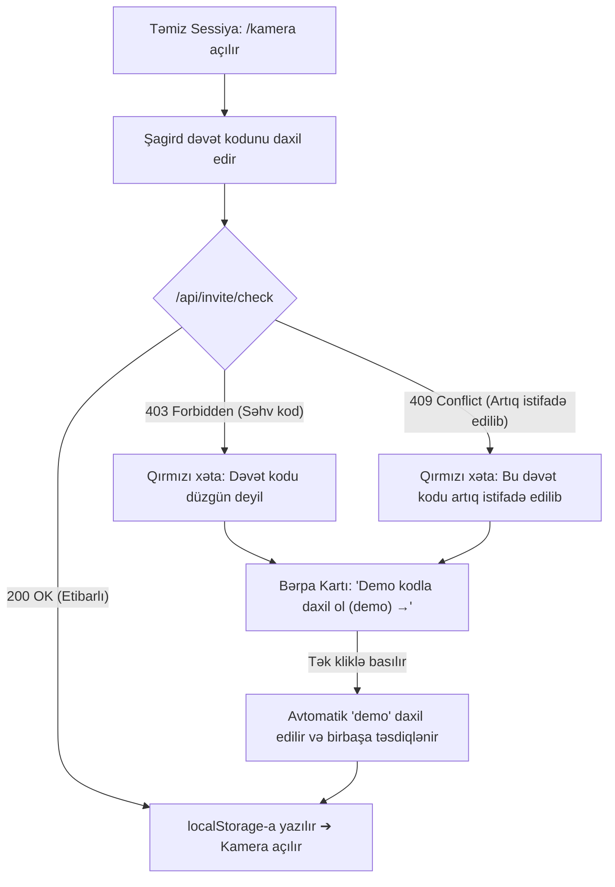

# Test Plan: Təmiz Sessiya Dəvət Qapısı və Bərpa Axını (TP-INVITE-RECOVERY)

**Sənəd Növü:** Quality Assurance & Testing Protocol (Test Planı)  
**Müəllif:** QA Tester (`/qa-tester`) & Antigravity  
**Tarix:** 2026-09-12  
**Hədəf Versiya:** v0.1.0 (Faza 1)  
**Əlaqəli Tapşırıqlar:** AG-018 (P2), Aytən Retest (Bug 1), [`docs/PHASE-1.md`](file:///c:/Programming/Tehsil-Platformasi/docs/PHASE-1.md)  
**Hədəf Fayllar:** [`web/components/kamera/InviteGate.tsx`](file:///c:/Programming/Tehsil-Platformasi/web/components/kamera/InviteGate.tsx), [`web/lib/cascade/guards.ts`](file:///c:/Programming/Tehsil-Platformasi/web/lib/cascade/guards.ts), [`web/app/api/invite/check/route.ts`](file:///c:/Programming/Tehsil-Platformasi/web/app/api/invite/check/route.ts)

---

## 1. Məqsəd və Kontekst

Faza 1-in 15–20 real şagird və abituriyent (Aytən, Kənan və s.) pilot sınağı ərəfəsində sistemə ilk dəfə daxil olan istifadəçilərin dəvət divarında (Invite Gate) ilişib qalmaması üçün təhlükəsiz bərpa mexanizmi təmin edilmişdir.

2026-09-11 Aytən retestində Bug 1 (Dəvət Qapısı bərpa kartı) mövcud brauzerdə artıq `th_invite_code` saxlandığı üçün yoxlanılmamışdı. Bu test planı həm avtomatlaşdırılmış, həm də əl ilə təmiz sessiya (Clean Session) sınaqları üçün addım-addım təlimat və test matrisini müəyyən edir.

---

## 2. Təmiz Sessiya (Clean Session) Test Protokolu

Alfa testçilər və QA mühəndisləri Dəvət Qapısını sınaqdan keçirmək üçün aşağıdakı 3 protokoldan birini tətbiq edirlər:

### Protokol A: Gizli Rejim (Incognito / Private Window) — Tövsiyə Olunan
1. Brauzerdə yeni "Incognito / Gizli" pəncərə açın (`Ctrl+Shift+N` və ya `Cmd+Shift+N`).
2. Birbaşa `https://tehsil-platformasi.vercel.app/kamera` (və ya `http://localhost:3000/kamera`) ünvanına keçin.
3. Dəvət kodu sorğulayan ekranın açıldığını yoxlayın.

### Protokol B: Brauzer Yaddaşının Təmizlənməsi (DevTools Console)
Mövcud brauzer pəncərəsində:
1. `F12` düyməsi ilə Developer Tools-u açın.
2. `Console` tabına keçin və aşağıdakı əmri icra edin:
   ```javascript
   localStorage.removeItem("th_invite_code");
   location.reload();
   ```
3. Səhifə yeniləndikdən sonra sistem dəvət qapısını göstərəcəkdir.

### Protokol C: Tam Tətbiq Sıfırlaması (Application Storage Clear)
1. DevTools ➔ `Application` (və ya `Storage`) tabına keçin.
2. Sol paneldə `Local Storage` ➔ domen adını seçin.
3. `th_invite_code` açarını silin və ya `Clear All` düyməsinə basın.

---

## 3. Bərpa Axınının İş Mexanizmi (UX & Recovery Logic)



### Əsas İntizam Qaydaları:
1. **1 Kliklə Keçid:** Şagird "Demo kodla daxil ol (demo) →" linkinə basdıqda input sahəsinə avtomatik `"demo"` yazılır və təkrar düymə axtarmadan dərhal sorğu göndərilir (`void submit("demo")`).
2. **Multi-Use Qorunması:** `"demo"` və `"demo2026"` kodları `MULTI_USE_DEMO_CODES` siyahısındadır və heç vaxt 409 xətası vermir.
3. **Erqonomik Geri Qayıdış:** Səhifənin yuxarısındakı `← Ana səhifə` düyməsi ilə şagird istədiyi vaxt ana ekrana qayıda bilər.

---

## 4. Test Keysləri Matrisi (Test Cases)

| ID | Test Ssenarisi | İlkin Vəziyyət | Daxil Edilən Giriş | Gözlənilən Nəticə | Status |
|---|---|---|---|---|---|
| **TC-INV-01** | Happy Path: Düzgün pilot kod | Təmiz sessiya (`th_invite_code` yoxdur) | `invite01` (və ya `tehsil2026`) | 200 OK; kod yaddaşa yazılır; kamera vizoru dərhal açılır. | ✅ PASS |
| **TC-INV-02** | Səhv kod daxil edilməsi | Təmiz sessiya | `sehv_kod_123` | 403 Forbidden; "Dəvət kodu düzgün deyil. Yenidən yoxla." xətası və demo bərpa kartı çıxır. | ✅ PASS |
| **TC-INV-03** | Artıq istifadə edilmiş kod | Başqa cihazda istifadə olunmuş kod | `ilkin-01` (claim olunmuş) | 409 Conflict; "Bu dəvət kodu artıq başqa istifadəçi tərəfindən istifadə edilib." xətası və demo bərpa kartı çıxır. | ✅ PASS |
| **TC-INV-04** | Demo bərpa kartından 1-kliklə keçid | Ekranda 403 və ya 409 xətası mövcuddur | "Demo kodla daxil ol (demo) →" kliklənir | İnputa "demo" yazılır, avtomatik təsdiq olunur, kamera maneəsiz açılır. | ✅ PASS |
| **TC-INV-05** | URL parametri ilə dəvət kodu | Təmiz sessiya | `/kamera?invite=demo` | URL-dən avtomatik oxunur, dəvət qapısı keçilir, kamera birbaşa açılır. | ✅ PASS |
| **TC-INV-06** | Boş və ya natamam daxiletmə | Təmiz sessiya | Boşluqlar `"   "` | "Davam et" düyməsi deaktiv qalır (disabled), şəbəkə sorğusu göndərilmir. | ✅ PASS |

---

## 5. Doğrulama və Avtomatlaşdırılmış Testlər

1. **Vahid Testlər:** `npx tsx web/lib/invite/url.selftest.mts` (URL sanitarizasiyası, 403, 409 və şəbəkə xətası emalı).
2. **TypeScript Kompilyasiyası:** `npx tsc --noEmit` (`InviteGate.tsx` tip təhlükəsizliyi).
3. **Pre-flight İnteqrasiyası:** `node scripts/preflight.mjs` tam uğurla nəticələnir.
